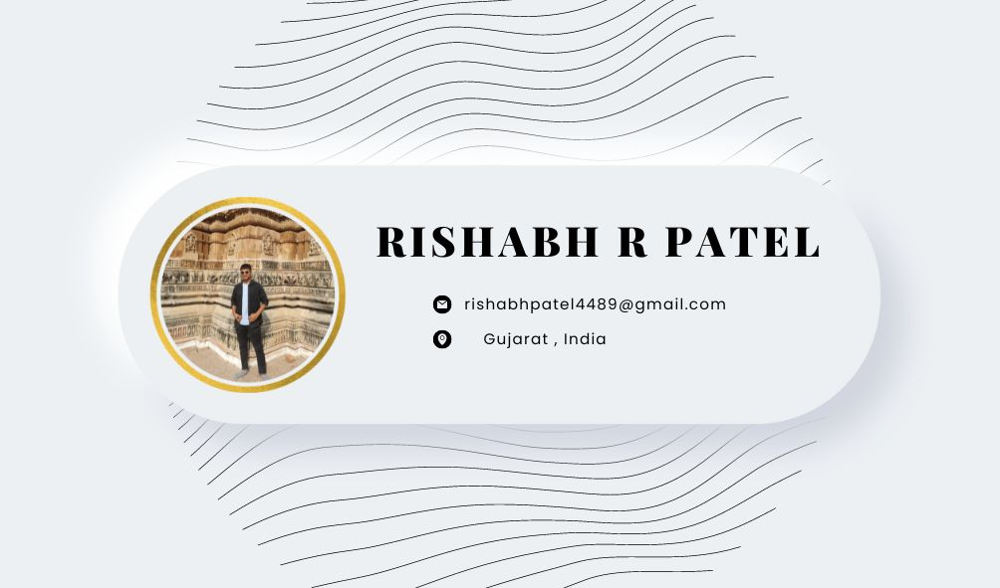

<h1 align="center">Hi , I'm Rishabh R Patel</h1>
<h3 align="center">B.E. Computer Engineering, Student at Madhuben & Bhanubhai Patel Institute of Technology, India</h3>

## Technologies💻

          

## Socials🤝🏻

 
